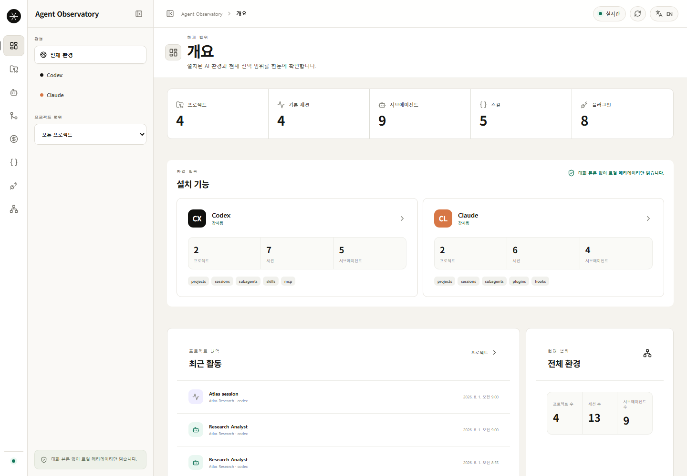
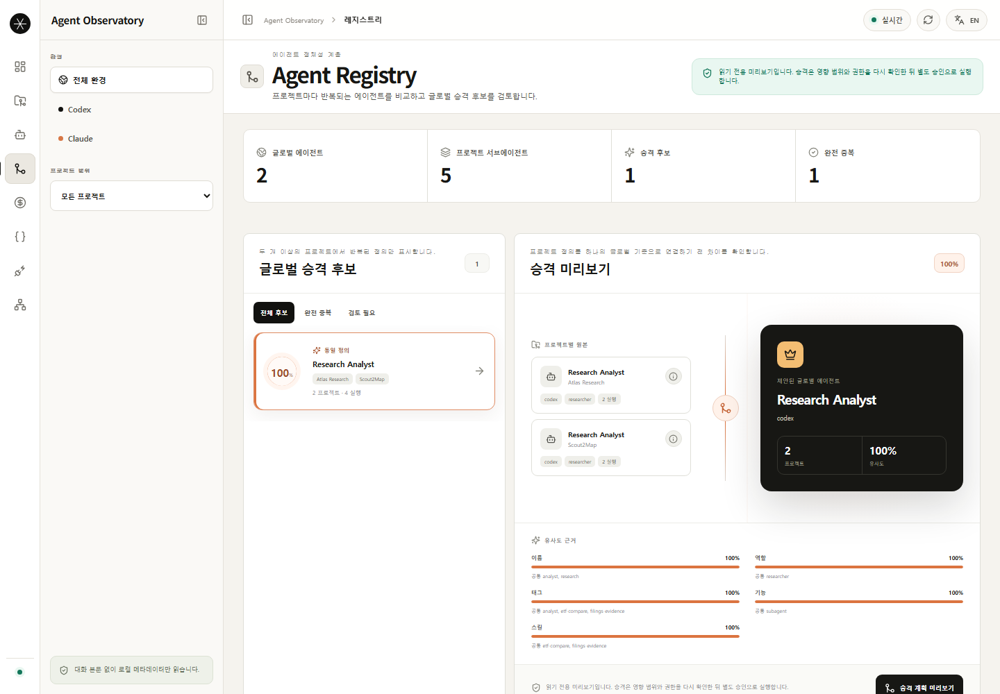
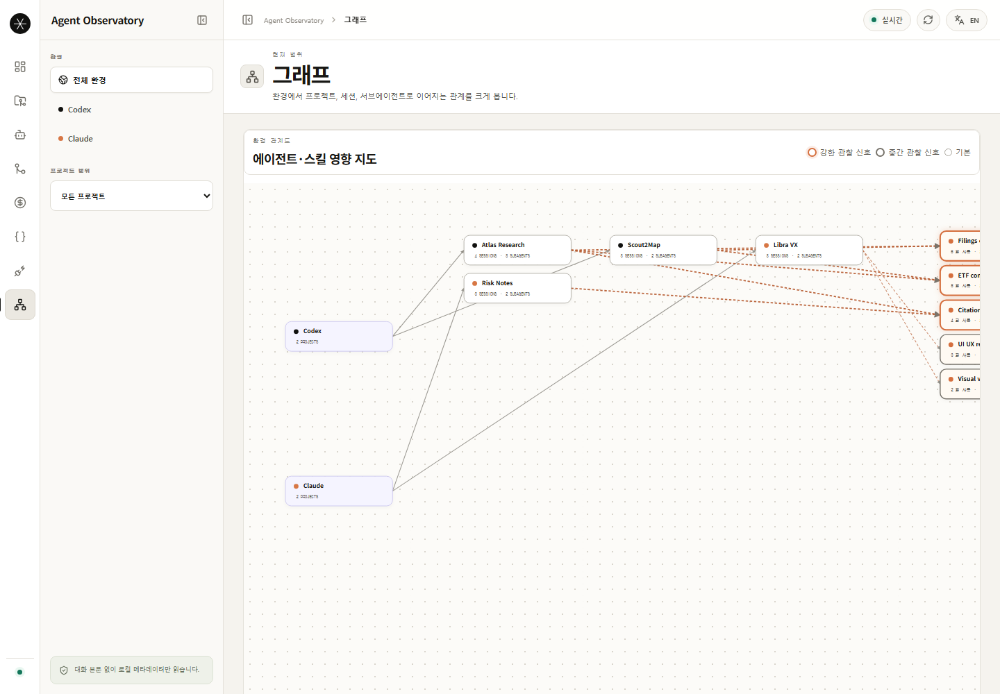
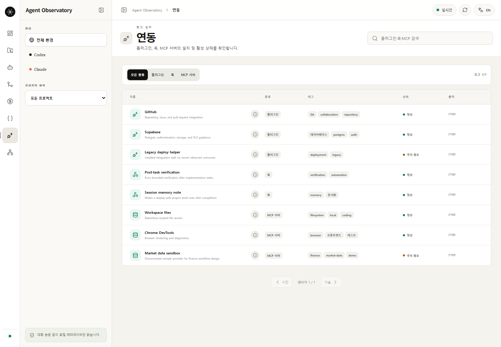
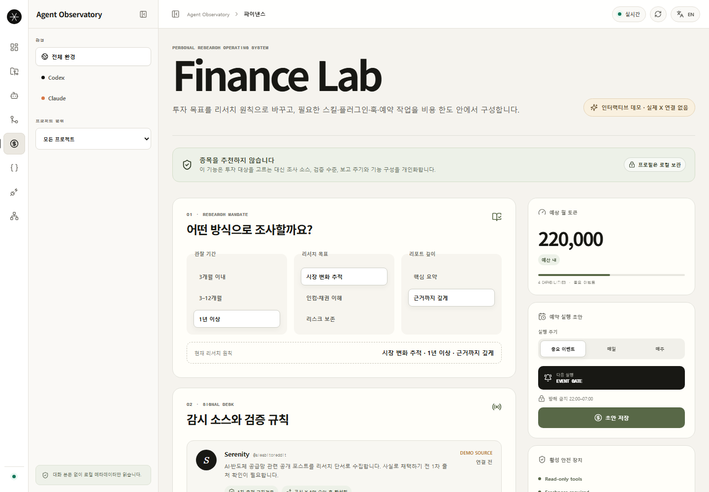

# Agent Observatory

### See what your agents use. Understand where they overlap. Promote only what should be shared.

A local-first control plane for exploring Codex and Claude projects, sessions,
subagents, skills, plugins, hooks, MCP servers, and approval-gated agent
promotion.

[한국어](./README.ko.md) · **English** · [Setup](./SETUP.md) · [Architecture](./docs/architecture/ARCHITECTURE.md) · [Deployment strategy](./docs/architecture/DEPLOYMENT_STRATEGY.md)

> The screenshots use a documentation-only demo snapshot. No contributor's
> local paths, prompts, session contents, credentials, or project data are used.

## Why this exists

AI development environments become fragmented quickly. Global agents sit beside
project-only agents. Skills and plugins accumulate across tools. The same role
appears under different names, and it becomes difficult to answer:

- Which agents and capabilities are installed?
- Which project actually uses each skill?
- Are two agents duplicates, related roles, or separate responsibilities?
- Should a repeated project agent become global?
- What would a promotion action create, and can it be undone safely?

Agent Observatory turns display-safe local metadata into an explainable
inventory, registry, and relationship graph.

## What you can do today

| Area | Current capability |
|---|---|
| **Observe** | Discover Codex, Claude, and shared-agent metadata from approved local roots |
| **Scope** | Move between global, environment, and individual project views |
| **Browse** | Search projects and agents; filter skills, plugins, hooks, and MCP servers |
| **Explain** | Inspect concise descriptions, source metadata, tags, and repeated execution counts |
| **Compare** | Compare project-agent names, roles, tags, capabilities, and observed skills with field-level evidence |
| **Graph** | View environment, project, role, and skill relationships with observed influence and reuse signals |
| **Promote** | Preview and create a new shared Markdown or Codex TOML agent definition after explicit approval |
| **Finance Lab** | Explore a disconnected personalization and research-workflow demo with cost and safety guardrails |

The graph's reuse score is a relative proxy based on observed uses, connections,
and project breadth. It is **not** a success rate, quality score, or token
efficiency measurement.

## Quick start

### Requirements

- Node.js 20 or later
- npm
- Optional local metadata in `~/.codex`, `~/.claude`, or `~/.agents`

### Install

~~~bash
git clone https://github.com/J3vn0/Agent-Observatory.git
cd Agent-Observatory
npm install
~~~

> [!IMPORTANT]
> Run every npm command from the repository root—the directory containing
> `package.json`. If npm reports `Could not read package.json`, verify your
> current directory before retrying.

### Run

Terminal 1:

~~~bash
npm run dev:daemon
~~~

Terminal 2:

~~~bash
npm run dev:dashboard
~~~

Open [http://127.0.0.1:4173](http://127.0.0.1:4173).

- **Live** means the loopback daemon returned a current local snapshot.
- **Fallback data** means the daemon is unavailable and the dashboard is showing
  safe sample data.

On PowerShell, confirm that you are in the correct directory:

~~~powershell
Get-Location
Test-Path .\package.json
~~~

`Test-Path` must return `True`. See [SETUP.md](./SETUP.md) for path overrides,
health checks, and troubleshooting.

## A three-minute product tour

### 1. Choose a scope

Start at the complete environment, narrow to Codex or Claude, and then select a
project. Project and session activity follow the active scope; installed
capability totals describe the current snapshot inventory.

### 2. Inspect repeated agents before promoting them

The Registry groups repeated project-agent definitions and shows why they match.
Select a candidate to inspect name, role, tag, capability, and skill evidence.
Promotion remains read-only until you request a plan and approve its exact
target.

Safety controls include:

- a short-lived plan;
- loopback-origin checks;
- an explicit approval header;
- new-file-only atomic creation;
- collision refusal instead of overwrite;
- hash-protected undo while the daemon session still owns the operation.

### 3. Follow relationships and observed reuse

The graph connects environments, projects, observed agent roles, and skills.
Stronger borders and edges indicate stronger evidence in the current view.
Select a node to see observed uses, connection count, project breadth, and the
source of its description.

Repeated descriptions do not necessarily mean duplicate agents. The scanner
uses privacy-safe role templates instead of exposing private prompts or session
messages, so separate executions of the same role may share one description.

### 4. Search the capability catalog

Skills and integrations are separated into focused pages. Search by name or
description, filter integrations by plugin, hook, or MCP server, and review
tags, health state, enabled state, and observation source.

### 5. Prototype a finance research setup

Finance Lab is an interactive, disconnected demo. It composes research
preferences, candidate capabilities, schedule drafts, estimated token cost, and
read-only guardrails. It does not connect to live market data, schedule a real
job, recommend securities, or execute trades.

## How the system works

~~~mermaid
flowchart LR
  C["Codex metadata"] --> D["Loopback daemon"]
  L["Claude metadata"] --> D
  A["Shared agent manifests"] --> D
  D --> R["Redact and normalize"]
  R --> S["Safe snapshot API"]
  S --> W["React dashboard"]
  W --> O["Observe"]
  W --> X["Compare"]
  W --> G["Graph"]
  W --> P["Preview approved promotion"]
~~~

The current daemon exposes a small JSON HTTP API on `127.0.0.1:4317`. During
development, Vite proxies `/api` and `/health` from the dashboard on
`127.0.0.1:4173`.

Environment-specific layouts are normalized into a shared model:

~~~text
Environment
  └── Project
      ├── Primary session
      └── Subagent execution
          └── Observed skills
~~~

Parent-session metadata is collected where it is safely available. The Agents
and Graph pages aggregate repeated executions by role to reduce visual noise.

## Technology stack

| Layer | Technology | Why it is used |
|---|---|---|
| **Runtime** | Node.js 20+, ESM | One cross-platform runtime for scanning, the local API, scripts, and workspace tooling |
| **Monorepo** | npm workspaces, lockfile v3 | Keeps dashboard, daemon, core contracts, and finance policy in one install and validation flow |
| **Dashboard** | React 19, React DOM 19 | Component-based desktop workspace and interactive evidence panels |
| **Language** | TypeScript 5.8 | Shared graph, environment, registry, and finance contracts |
| **Build tooling** | Vite 6 | Fast local development, React compilation, production bundles, and API proxying |
| **Navigation/state** | React hooks and URL hash routing | Lightweight local navigation without a routing or global-state dependency |
| **UI** | Plain CSS and Lucide React | A small dependency surface with a custom white desktop-first design system |
| **Local API** | Node `http`, `fs`, `path`, and `crypto` | Loopback-only JSON service without Express or another server framework |
| **Core domain** | TypeScript ESM package | Deterministic taxonomy, scope, execution grouping, similarity, and graph contracts |
| **Finance domain** | TypeScript ESM package | Research preferences, safety posture, provenance rules, and demo guardrails |
| **Testing** | Vitest 3 and Node's built-in test runner | Vitest for TypeScript packages; `node --test` for the dependency-light daemon |
| **Current storage** | Fixture fallback, in-memory cache/action state, limited `localStorage` | Keeps the current MVP local and dependency-light while persistence contracts are designed |

### Database and deployment direction

No database, cloud account, container runtime, model API, or external MCP server
is required for the current MVP.

- SQLite is the planned local persistence layer for normalized observations.
- Supabase is a possible future opt-in sync layer for accounts, teams,
  sanitized shared definitions, and finance collection results—not a
  replacement for private local scan storage.
- Docker remains optional for hosted services, isolated workers, or reproducible
  integration environments.

The architecture document includes both current implementation and target
design. See [ARCHITECTURE.md](./docs/architecture/ARCHITECTURE.md) and
[DEPLOYMENT_STRATEGY.md](./docs/architecture/DEPLOYMENT_STRATEGY.md).

## Privacy and mutation boundary

Discovery is read-only by default. The dashboard receives display-safe metadata,
not unrestricted local content.

| Returned to the dashboard | Not returned |
|---|---|
| Environment identifier and detected state | Conversation messages or prompts |
| Sanitized project label | Agent instructions or arbitrary source files |
| Opaque session identifier and relationship | Commands, arguments, tool inputs, or outputs |
| Explicit role and skill attribution | URLs, headers, tokens, or environment values |
| Installed capability name, tags, and state | Usernames, absolute home paths, or credentials |
| Observation timestamp and redaction summary | Credential-bearing configuration values |

Approved Registry promotion is the narrow write exception. It creates a new
definition and refuses to overwrite an existing target.

## Configuration

Defaults work without an `.env` file:

~~~dotenv
AGENT_OBSERVATORY_CODEX_HOME=
AGENT_OBSERVATORY_CLAUDE_HOME=
AGENT_OBSERVATORY_AGENTS_HOME=
AGENT_OBSERVATORY_PORT=4317
VITE_OBSERVATORY_API=
~~~

Useful local checks:

~~~bash
# daemon health
curl http://127.0.0.1:4317/health

# display-safe normalized snapshot
curl http://127.0.0.1:4317/api/snapshot
~~~

## Repository layout

~~~text
apps/
  dashboard/       React + Vite workspace and evidence-focused pages
  daemon/          Loopback scanner, snapshot API, and promotion planner
packages/
  core/            Graph, registry, scope, taxonomy, and similarity contracts
  finance/         Finance research preferences, policy, and guardrails
scripts/
  capture-readme-screenshots.mjs
docs/
  architecture/    Current and target architecture decisions
  assets/readme/   Documentation-only snapshot and product screenshots
  design/          Dashboard and interaction specifications
  finance/         Finance expansion plans
obsidian/          Durable project memory and work logs
~~~

## Validation

~~~bash
npm run typecheck
npm test
npm run build
~~~

The default test suite does not require an external MCP server, finance provider,
database, or model API.

Regenerate the README images after meaningful dashboard changes:

~~~bash
npm run docs:screenshots
~~~

The capture script uses a synthetic snapshot and loopback-only temporary
servers. Review every generated image before committing.

## Current boundaries and roadmap

| Status | Capability |
|---|---|
| ✅ Available | Codex and Claude environment discovery |
| ✅ Available | Global, environment, and project scope |
| ✅ Available | Project/session/subagent inventory and role aggregation |
| ✅ Available | Searchable skill and integration catalogs |
| ✅ Available | Explainable project-agent comparison and promotion candidates |
| ✅ Available | Preview, create, and hash-protected undo for new agent definitions |
| ✅ Available | Agent/skill graph with evidence-based relative signals |
| 🧪 Demo | Finance personalization and workflow composition |
| 🛠 Planned | SQLite persistence and historical usage metrics |
| 🛠 Planned | Explainable skill/plugin similarity and lifecycle management |
| 🛠 Planned | Agent capability adoption with token/cost budgets |
| 🛠 Planned | Approved read-only finance data collectors |
| 🛠 Planned | Optional Supabase account/team synchronization |

> [!CAUTION]
> Agent Observatory does not provide investment advice or execute trades.

## Contributing

Issues and focused pull requests are welcome. Keep scanners read-only, preserve
the privacy boundary, distinguish implemented behavior from planned behavior,
and run the validation commands before submitting changes.

Built by [J3vn0](https://github.com/J3vn0).
