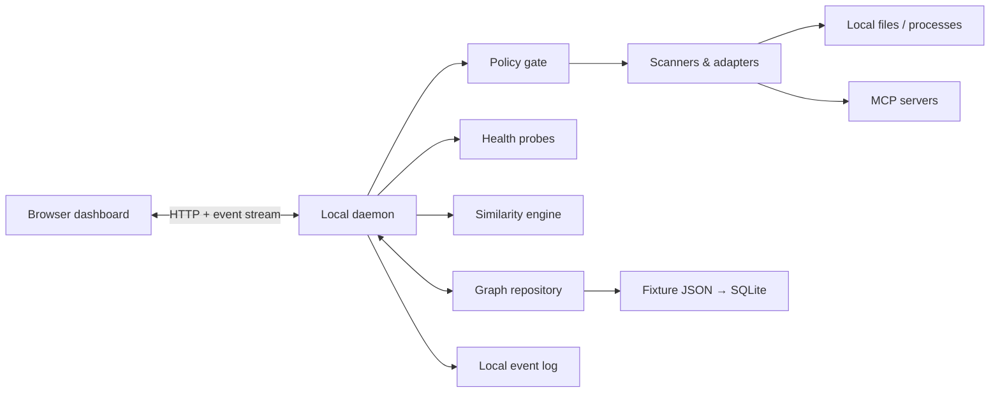

# Agent Observatory: Local-First System Architecture

## 1. Architecture goals

Agent Observatory is a local control plane for discovering, understanding, and safely operating agents, skills, and MCP servers. The MVP should make the local system legible without turning it into a distributed platform.

The architecture optimizes for:

- local-first discovery and storage;
- read-only behavior by default;
- explainable, deterministic health and similarity results;
- one set of typed contracts shared by the daemon and dashboard;
- adapters that isolate editor, agent-runtime, and MCP configuration differences;
- a fixture-first path that lets the dashboard ship before live discovery is complete;
- finance-specific provenance and safety metadata without coupling the core to finance.

The MVP explicitly does **not** require cloud accounts, remote telemetry, message brokers, containers, a graph database, multi-user tenancy, or autonomous configuration changes.

## 2. Runtime topology



The dashboard is a static web application served by, or explicitly connected to, one daemon bound to the loopback interface. The daemon owns all filesystem and process access. The browser never receives credential values or unrestricted local paths.

For the first vertical slice, the daemon may run the fixture repository and API in one Node.js process. SQLite, live scanners, and process supervision are incremental additions behind existing interfaces.

## 3. Components

### 3.1 Dashboard

The dashboard is a browser-based control plane with six initial views: Overview, Integration Matrix, Graph Explorer, Skill Library, Compare, and Agent Builder.

Responsibilities:

- fetch graph snapshots, summaries, and probe results from the daemon;
- render health, capability coverage, relationship evidence, and finance safety signals;
- subscribe to a daemon event stream and selectively invalidate cached queries;
- submit requested operations as typed intents;
- make policy decisions visible before a potentially mutating operation.

The dashboard must not scan the filesystem, invoke MCP tools, store secrets, or independently calculate authoritative health. It may perform presentation-only filtering and layout.

### 3.2 Local daemon

The daemon is the sole trusted runtime boundary. In the MVP it is a modular monolith with an HTTP API.

Responsibilities:

- coordinate scans and normalize adapter output;
- validate and persist graph changes;
- schedule bounded, read-only health probes;
- calculate similarity reports from a stable graph snapshot;
- evaluate requested operations against policy;
- expose snapshots, reports, and events to the dashboard;
- redact sensitive values before serialization or logging.

The daemon should bind to `127.0.0.1` by default. It should reject non-loopback origins unless the user explicitly opts into another deployment mode. A per-launch session token or equivalent same-user authorization should protect operation endpoints; read endpoints should use the same mechanism once live local data is exposed.

### 3.3 Scanners and adapters

Scanners find candidate configuration sources. Adapters parse one source format and emit normalized observations.

Examples:

- Codex skill and agent directories;
- Claude, Cursor, or other agent-runtime configuration;
- project-local skill manifests;
- MCP client configuration files;
- MCP server manifests and package metadata;
- Git worktrees and project metadata.

Adapters implement a narrow contract and must:

- be read-only during discovery;
- preserve source provenance;
- report parse errors as data instead of stopping the entire scan;
- emit credential references, never credential values;
- avoid following symlinks outside an approved scan root unless explicitly enabled;
- attach adapter name and version to every observation.

Scanner output is not written directly to storage. It passes through normalization, validation, policy checks, and graph reconciliation.

### 3.4 Graph repository

The core uses a property-graph model represented by typed nodes and edges. Storage is abstracted behind `GraphRepository`.

MVP storage path:

1. immutable JSON fixture loaded into memory;
2. mutable in-memory repository for scan reconciliation tests;
3. local SQLite database using ordinary node, edge, observation, probe, and event tables.

SQLite is sufficient for expected local scale and provides transactions, indexes, portability, and simple backup. Graph traversal required by the MVP is shallow and can be implemented with indexed queries plus in-process traversal. A dedicated graph database is not justified until measured query depth or graph size proves otherwise.

Stable logical identifiers are derived from normalized source identity, such as `skill:codex:<canonical-name>` or `mcp-server:<config-source>:<server-name>`. Database row identifiers must not leak into public contracts.

### 3.5 Health probes

Health is evidence with an observation time, not a permanent property of a node. Probes are explicit, bounded, and classified by risk.

Initial probe types:

- `config-parse`: configuration can be parsed and normalized;
- `path-exists`: referenced executable or skill path exists;
- `process-start`: an MCP stdio server reaches an initialized state;
- `mcp-handshake`: protocol initialization succeeds;
- `mcp-list-tools`: tool discovery succeeds without invoking a tool;
- `http-reachability`: configured loopback or approved remote endpoint responds;
- `freshness`: finance data or cached metadata is within a declared threshold.

Probe rules:

- no tool invocation during a health check unless a provider-specific probe is explicitly declared read-only;
- timeouts and output limits are mandatory;
- child processes are terminated when the probe completes or times out;
- stderr and environment values are redacted before storage;
- repeated probes use backoff and per-target concurrency limits;
- `unknown` is distinct from `unhealthy`.

### 3.6 Deterministic similarity engine

Similarity is calculated from normalized graph features, not an opaque model call. Given the same graph snapshot, engine version, and weights, the output must be identical.

Initial features:

- provided MCP tools and capabilities;
- tags by domain, function, runtime, and risk;
- declared inputs and outputs;
- permissions;
- dependencies;
- normalized description tokens;
- graph-neighborhood overlap.

A simple initial score is a weighted combination of Jaccard similarities:

```text
score =
  0.35 × capability overlap +
  0.20 × tool overlap +
  0.15 × tag overlap +
  0.10 × dependency overlap +
  0.10 × permission overlap +
  0.10 × description-token overlap
```

Missing feature groups contribute neither a perfect match nor an automatic mismatch; weights are renormalized across feature groups available for both entities. Every report returns the effective weights, matched and unmatched evidence, exclusions, graph revision, and algorithm version.

Similarity does not itself declare that an item should be deleted. It emits duplicate risk and evidence for a user decision. Exact manifest fingerprints can be reported separately from semantic similarity.

### 3.7 Policy and permission layer

Policy is enforced in the daemon before scanning protected roots, starting processes, reading remote endpoints, or changing configuration.

Operations are categorized as:

- `observe`: read declared files and existing metadata;
- `probe`: start a bounded process or network handshake without invoking a capability;
- `invoke-read`: invoke a tool declared and verified as read-only;
- `mutate-local`: install, edit, disable, or remove local configuration;
- `mutate-external`: send, trade, publish, or modify an external system.

The MVP automatically permits only approved-root `observe` operations. `probe` operations require explicit configuration and visible scope. Mutating operations are modeled in contracts but are not implemented in the first vertical slice.

Policy decisions contain a decision, reason code, matched rule, required approval, and requested scope. The UI renders this record rather than inferring permission from button state.

Finance defaults are stricter:

- market, filing, ETF, bond, and macro connectors begin as read-only;
- every data observation records source and observation time;
- facts and derived analysis are distinguishable;
- personalized investment advice and trade execution are outside the MVP;
- stale or uncited data is visible and cannot silently appear current.

### 3.8 Event log and stream

The daemon records domain events locally and exposes a best-effort event stream to the dashboard. This is not a message bus.

Useful events include:

- `scan.started`, `scan.completed`, `scan.failed`;
- `graph.reconciled`;
- `probe.started`, `probe.completed`;
- `similarity.computed`;
- `policy.denied`;
- `operation.requested`.

Each event has an ID, timestamp, graph revision where relevant, redacted payload, and correlation ID. Events support auditability and UI refresh; authoritative state remains in the graph repository. If the browser disconnects, it refetches a snapshot rather than replaying an unlimited event history.

## 4. Event flow

### 4.1 Discovery and reconciliation

1. The dashboard requests a scan or the user starts the daemon with scanning enabled.
2. The policy layer resolves approved roots and permitted adapter types.
3. The coordinator asks scanners for source descriptors.
4. Adapters parse sources and return observations plus structured diagnostics.
5. The normalizer canonicalizes identifiers, tags, paths, and capabilities.
6. The validator rejects invalid records without discarding valid sibling records.
7. The reconciler computes an atomic node-and-edge change set.
8. The graph repository commits the change set and increments `graphRevision`.
9. The daemon emits `graph.reconciled`; the dashboard refetches affected summaries.

Nodes absent from a later scan are first marked `stale` with provenance. Automatic deletion is avoided because a source may be temporarily unavailable.

### 4.2 Probe flow

1. A probe request names a target and probe type.
2. Policy evaluates target, transport, roots, and risk.
3. The probe runner applies timeout, output, and concurrency limits.
4. A normalized `HealthObservation` is stored.
5. Node health is derived from the latest applicable observations.
6. The daemon emits `probe.completed`.

### 4.3 Similarity flow

1. The API captures one graph revision.
2. The feature extractor creates canonical feature sets for both entities.
3. The engine calculates component scores and effective weights.
4. The report is stored or cached with algorithm version and graph revision.
5. The response returns score and evidence together.

## 5. Privacy and trust boundary

Data remains on the user's machine by default. The trust boundary encloses the daemon, its local database, approved scan roots, and child processes started for probes.

The following must never enter the graph or event payloads:

- API keys, tokens, passwords, cookies, or private-key contents;
- full inherited process environments;
- arbitrary file contents not required by a registered adapter;
- finance account identifiers or holdings unless a future feature explicitly requires and protects them.

Credential metadata is represented as a reference containing provider, source kind, and availability status. For example, the graph may record that `OPENAI_API_KEY` is referenced and present, but never its value.

Remote MCP endpoints cross the local privacy boundary. The daemon must show the destination, transport, and requested probe before connection. No Observatory telemetry or external model call is required for core scanning, health, graph traversal, or similarity.

## 6. MCP transport assumptions

The transport layer is behind an `McpClientFactory` and makes no transport-specific assumptions in graph logic.

MVP assumptions:

- support local `stdio` servers first;
- add Streamable HTTP for explicitly configured endpoints;
- treat legacy HTTP/SSE configurations as an adapter concern rather than a core model;
- perform initialization and capability/tool listing only for default health probes;
- never invoke an advertised tool merely to prove it exists;
- capture protocol/version negotiation as probe evidence;
- enforce startup, handshake, and idle timeouts;
- use an allowlist of environment-variable names passed to child processes;
- redact command arguments that adapters identify as sensitive;
- permit at most a small configurable number of concurrent starts.

An MCP server is not considered healthy solely because its process starts. Transport initialization and declared-capability discovery are separate observations so the UI can explain partial failure.

## 7. Package boundaries

```text
apps/
  dashboard/           Browser UI; imports contracts and presentation helpers only
  daemon/              Composition root, HTTP API, scheduling, process lifecycle
packages/
  core/                IDs, nodes, edges, events, validation, repository interfaces
  adapters/            Source descriptors and runtime-specific parsers
  graph-store/         Fixture, memory, and later SQLite repository implementations
  health/              Probe definitions and bounded probe runners
  similarity/          Feature extraction and deterministic scoring
  policy/              Operation classification and policy evaluation
  mcp-client/          MCP transport adapters and redaction boundary
  finance/             Finance tags, provenance rules, freshness and safety policies
```

Dependency direction:

```text
dashboard → core
daemon → core + adapters + graph-store + health + similarity + policy + mcp-client + finance
adapters/health/similarity/policy/mcp-client/finance → core
graph-store → core
core → no application package
```

`core` must not import Node.js filesystem, subprocess, HTTP server, React, or finance-specific code. The daemon is the composition root and the only package that selects concrete implementations.

For the initial repository, some proposed packages may begin as modules inside `apps/daemon`. They should still obey these boundaries. Extracting a package is justified when a second consumer exists or the module needs an independent test surface.

## 8. Initial TypeScript data model

The proposal favors serializable discriminated unions and small interfaces. Runtime validation should accompany these types at API and adapter boundaries.

```ts
export type NodeKind =
  | "agent"
  | "skill"
  | "mcpServer"
  | "mcpTool"
  | "project"
  | "provider"
  | "credentialRef"
  | "tag"
  | "permission"
  | "execution"
  | "memory"
  | "workflow";

export type EdgeKind =
  | "uses"
  | "requires"
  | "provides"
  | "overlaps"
  | "conflictsWith"
  | "installedIn"
  | "invokedBy"
  | "readsFrom"
  | "writesTo";

export type EntityId = string;
export type ObservationId = string;
export type ISODateTime = string;

export interface SourceRef {
  adapter: string;
  adapterVersion: string;
  sourceId: string;
  displayPath?: string; // Redacted or workspace-relative.
  observedAt: ISODateTime;
  fingerprint?: string;
}

export interface GraphNode {
  id: EntityId;
  kind: NodeKind;
  name: string;
  description?: string;
  tags: string[];
  capabilities: string[];
  status: "active" | "disabled" | "stale" | "unknown";
  attributes: Record<string, string | number | boolean | string[]>;
  sources: SourceRef[];
}

export interface GraphEdge {
  id: string;
  kind: EdgeKind;
  from: EntityId;
  to: EntityId;
  weight?: number;
  evidence: Evidence[];
  sources: SourceRef[];
}

export interface Evidence {
  code: string;
  label: string;
  value?: string | number | boolean;
  sourceId?: string;
}

export interface GraphSnapshot {
  revision: number;
  generatedAt: ISODateTime;
  nodes: GraphNode[];
  edges: GraphEdge[];
}

export interface AdapterObservation {
  observationId: ObservationId;
  source: SourceRef;
  nodes: GraphNode[];
  edges: GraphEdge[];
  diagnostics: Diagnostic[];
}

export interface Diagnostic {
  severity: "info" | "warning" | "error";
  code: string;
  message: string;
  sourceId?: string;
  recoverable: boolean;
}

export type HealthState =
  | "healthy"
  | "degraded"
  | "unhealthy"
  | "unknown";

export interface HealthObservation {
  id: ObservationId;
  targetId: EntityId;
  probeType:
    | "config-parse"
    | "path-exists"
    | "process-start"
    | "mcp-handshake"
    | "mcp-list-tools"
    | "http-reachability"
    | "freshness";
  state: HealthState;
  observedAt: ISODateTime;
  durationMs: number;
  summary: string;
  evidence: Evidence[];
  expiresAt?: ISODateTime;
}

export interface SimilarityComponent {
  feature:
    | "capabilities"
    | "tools"
    | "tags"
    | "dependencies"
    | "permissions"
    | "description";
  score: number;
  effectiveWeight: number;
  matched: string[];
  onlyLeft: string[];
  onlyRight: string[];
}

export interface SimilarityReport {
  leftId: EntityId;
  rightId: EntityId;
  score: number;
  duplicateRisk: "low" | "medium" | "high";
  algorithmVersion: string;
  graphRevision: number;
  components: SimilarityComponent[];
  exclusions: string[];
}

export type OperationKind =
  | "observe"
  | "probe"
  | "invoke-read"
  | "mutate-local"
  | "mutate-external";

export interface OperationIntent {
  id: string;
  kind: OperationKind;
  targetIds: EntityId[];
  action: string;
  scope: Record<string, string | string[]>;
  requestedAt: ISODateTime;
}

export interface PolicyDecision {
  intentId: string;
  decision: "allow" | "deny" | "require-approval";
  reasonCode: string;
  matchedRule: string;
  approvedScope?: Record<string, string | string[]>;
}

export interface DomainEvent<T = unknown> {
  id: string;
  type: string;
  occurredAt: ISODateTime;
  correlationId: string;
  graphRevision?: number;
  payload: T;
}
```

Core ports:

```ts
export interface SourceAdapter {
  readonly id: string;
  supports(source: SourceDescriptor): boolean;
  observe(source: SourceDescriptor, signal: AbortSignal):
    Promise<AdapterObservation>;
}

export interface GraphRepository {
  getSnapshot(): Promise<GraphSnapshot>;
  getNode(id: EntityId): Promise<GraphNode | undefined>;
  reconcile(batch: AdapterObservation[]): Promise<{ revision: number }>;
  appendHealth(observation: HealthObservation): Promise<void>;
}

export interface PolicyEngine {
  evaluate(intent: OperationIntent): Promise<PolicyDecision>;
}

export interface SimilarityEngine {
  compare(
    leftId: EntityId,
    rightId: EntityId,
    snapshot: GraphSnapshot,
  ): SimilarityReport;
}
```

## 9. API surface for the vertical slice

The daemon can begin with a small versioned API:

- `GET /api/v1/status`
- `GET /api/v1/graph`
- `GET /api/v1/summary`
- `GET /api/v1/entities/:id`
- `GET /api/v1/health`
- `POST /api/v1/scans`
- `POST /api/v1/probes`
- `POST /api/v1/similarity`
- `GET /api/v1/events`

`POST` endpoints accept an `OperationIntent` or create one internally and return the associated `PolicyDecision`. Long-running work returns an operation ID; the browser observes completion through the event stream or status polling.

Pagination and graph-slice queries can be added after fixture size demonstrates a need. The first fixture should remain small enough for one complete graph response.

## 10. Failure modes and containment

| Failure | Required behavior |
|---|---|
| One malformed config | Record a diagnostic; continue scanning other sources. |
| Missing scan root | Mark source unavailable; do not remove prior entities immediately. |
| Permission denied | Return a policy/filesystem diagnostic without retry loops. |
| Symlink escapes approved root | Skip target and record a policy denial. |
| MCP process hangs | Enforce timeout, terminate child, store `unhealthy` evidence. |
| MCP process floods output | Truncate at a fixed byte limit and terminate if necessary. |
| MCP handshake succeeds but tool listing fails | Report degraded health with both observations. |
| Remote endpoint unavailable | Preserve configuration node and record time-bounded probe failure. |
| Adapter emits duplicate IDs | Reject conflicting records from that adapter batch; retain last valid graph. |
| SQLite transaction fails | Roll back the full reconciliation and keep the prior revision. |
| Daemon exits during scan | No partial revision becomes visible; next launch may scan again. |
| Dashboard loses event stream | Refetch current revision and continue with polling fallback. |
| Similarity feature missing | Renormalize available weights and list the exclusion. |
| Sensitive value detected | Redact before logs/storage and emit a local security diagnostic. |
| Finance data is stale or uncited | Preserve it as stale/unsupported evidence; do not present as current fact. |

The daemon should prefer partial visibility over global failure, but graph reconciliation remains atomic so users never see half of a scan.

## 11. Incremental delivery path

### Phase 0: typed fixture

- Define runtime-validated core contracts.
- Create one finance-flavored fixture with agents, skills, MCP servers, tools, permissions, and health observations.
- Serve the fixture through `GET /graph` and `GET /summary`.
- Implement deterministic similarity against the fixture.
- Build dashboard views without filesystem or process access.

Exit criterion: the UI can explain health, missing capabilities, and one high-overlap pair entirely from fixture evidence.

### Phase 1: read-only file scanning

- Add approved scan-root configuration.
- Implement one Codex skill adapter and one MCP config adapter.
- Reconcile live observations into the in-memory repository.
- Expose structured diagnostics and graph revisions.

Exit criterion: fixture and live adapters produce the same normalized contracts and contract tests pass for both.

### Phase 2: durable local storage

- Add SQLite behind `GraphRepository`.
- Persist source observations, graph revisions, health history, and redacted events.
- Add stale-source handling and database export/backup.

Exit criterion: restart preserves the last known graph and source provenance.

### Phase 3: bounded health

- Add path and config probes.
- Add MCP stdio initialization and tool-list probes.
- Add concurrency, timeout, output, and environment controls.

Exit criterion: health states are reproducible, time-stamped, and never require mutating tool invocation.

### Phase 4: additional adapters and finance rules

- Add runtime adapters based on user demand.
- Add Streamable HTTP probing for explicitly approved endpoints.
- Enforce finance provenance, freshness, and read-only policies.
- Add integration matrix and compare workflows over live data.

Exit criterion: a finance research setup can prove connector health, source freshness, permissions, and capability coverage.

### Phase 5: guarded management operations

- Design previews and reversible plans for installation, customization, disabling, and removal.
- Require explicit approval and capture before/after evidence.
- Keep external mutations, trading, and autonomous remediation out of scope until separately designed.

## 12. Testing strategy

- contract tests run every adapter observation through runtime validation;
- repository conformance tests run against fixture, memory, and SQLite implementations;
- golden tests lock deterministic similarity inputs, scores, and evidence;
- policy table tests cover each operation category and finance override;
- probe tests use controlled fake processes and servers with timeout/flood/failure cases;
- redaction tests use seeded fake secrets and assert they never appear in snapshots, events, or diagnostics;
- one vertical-slice integration test loads the fixture through the daemon API and verifies dashboard-critical summaries.

No live external MCP server or finance provider is required for the default test suite.

## 13. Initial architecture decisions

1. Use a modular monolith and one local daemon process.
2. Keep the dashboard unprivileged; all local access crosses typed daemon APIs.
3. Start with a fixture repository, then add SQLite behind the same port.
4. Treat health, provenance, and similarity as time/version-stamped evidence.
5. Use deterministic weighted similarity with visible components.
6. Model mutations now but do not implement them in the first vertical slice.
7. Keep finance as a domain package that extends tags and policy, not as a dependency of core.
8. Add infrastructure only in response to measured local scale or reliability needs.
