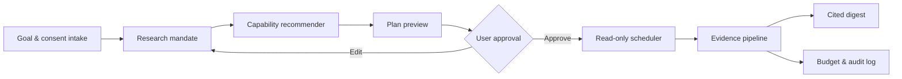

# Finance Personalization & Monitoring Plan

Status: proposed MVP  
Last updated: 2026-07-26

## Product intent

Finance Lab extends Agent Observatory into a personal research control plane. A short questionnaire turns a user's goals into an inspectable configuration of research skills, plugins, MCP sources, hooks, recurring tasks, verification rules, and cost limits.

The system personalizes **how research is performed**, not **what the user should buy**.

### Allowed

- Select research domains, jurisdictions, time horizon, depth, and cadence.
- Recommend skills, plugins, sources, and read-only MCP tools.
- Recommend verification thresholds, quiet hours, retention, and token/API budgets.
- Collect public information through approved APIs and licensed sources.
- Summarize sourced facts, derived analysis, uncertainty, and conflicting evidence.

### Not allowed

- Personalized buy, sell, hold, allocation, position-size, or suitability advice.
- Security rankings based on the user's financial profile.
- Brokerage credentials, order entry, portfolio mutation, or automated trading.
- Silent plugin installation, permission expansion, monitoring, or schedule creation.
- Scraping that bypasses access controls or conflicts with provider terms.

## Experience



The user always sees:

1. Why each capability was proposed.
2. Exact permissions and credentials required.
3. Sources, cadence, freshness, and retention.
4. Estimated tokens, API units, and monthly cost.
5. Safety limits and unsupported states.
6. A separate approval action before activation.

## Intake model

The MVP questionnaire intentionally avoids holdings, net worth, or brokerage data.

| Dimension | Example choices | Configuration effect |
|---|---|---|
| Research goal | Market shifts, income/fixed income, downside context | Source bundle and report template |
| Observation horizon | Under 3 months, 3–12 months, over 1 year | Cadence and historical context |
| Evidence depth | Concise, standard, deep | Model tier, retrieval depth, token ceiling |
| Domains | ETF, bonds, filings, macro, AI supply chain | Skill and source tags |
| Notification tolerance | Event-only, daily, weekly | Hook and schedule policy |
| Privacy | Local-only, retention period, export | Storage and deletion policy |
| Budget | Per-run and monthly ceiling | Model, API, and alert limits |

A risk-related answer may increase caution, primary-source requirements, downside coverage, and educational context. It must not change security ranking or generate a call to action.

## Capability recommendation

The recommender operates over Agent Observatory's verified registry.

```ts
interface FinanceWorkflowProposal {
  id: string;
  goalSnapshotId: string;
  capabilities: Array<{
    capabilityId: string;
    version: string;
    reasonCodes: string[];
    permissions: string[];
    estimatedTokens: number;
    estimatedApiUnits: number;
  }>;
  sources: SourceMonitorProposal[];
  schedules: ScheduleProposal[];
  guardrails: string[];
  consentVersion: string;
  status: "draft" | "approved" | "paused" | "blocked";
}
```

Selection rules:

- Prefer installed, healthy, finance-tagged, read-only capabilities.
- Reject capabilities with missing provenance, excessive permissions, or write operations.
- Penalize redundant skills and merge overlapping schedules.
- Show lower-cost alternatives.
- Explain every recommendation with deterministic reason codes.
- Keep installation, credentials, source monitoring, and scheduling as separate approvals.

## Serenity / X monitor

The initial demo watchlist contains the pseudonymous X account Serenity, currently identified by third-party trackers as `@aleabitoreddit`. This identity must remain configurable and reverified before any production connection.

X is a **lead source**, never authoritative market evidence.

Production requirements:

- Use the official X API or an explicitly licensed provider.
- Monitor only user-approved accounts, lists, entities, or queries.
- Persist post ID, author ID, canonical URL, authored time, retrieval time, edit/deletion state, and monitor ID.
- Store identifiers and hashes by default; retain full text only where terms and user policy permit.
- Mark social claims as `unverified_lead`.
- Require primary-source corroboration before factual inclusion.
- Treat posts and linked pages as untrusted input and isolate prompt injection.
- Apply quota-aware pagination, caching, deduplication, bounded concurrency, and backoff.
- Expose degraded/blocked status when authentication, licensing, or rate limits fail.

The X API's recent-search endpoint can retrieve public posts from the previous seven days and requires an approved developer app and bearer token. Historical coverage and pricing depend on the selected access tier. The production adapter must not depend on browser cookies or unofficial scraping.

## Evidence pipeline

```text
metadata gate
  → duplicate/edit detection
  → low-cost relevance classifier
  → source classification
  → primary-source retrieval
  → corroboration/conflict check
  → expensive synthesis only for qualifying events
  → cited digest
```

Every assertion is one of:

- `sourced_fact`
- `normalized_fact`
- `derived_analysis`
- `unverified_lead`
- `unsupported_or_conflicted`

Required provenance includes source URL, publisher, authored/published/observed time, retrieval method, capability versions, workflow proposal ID, and actual cost.

## Token and cost control

Budgets exist at organization, user, workflow, and run levels.

- Hard token and model-tier limit.
- API request and licensed-data-unit limit.
- Wall-clock timeout and maximum concurrency.
- Storage and retention ceiling.
- Alert-per-day and monthly cost ceiling.
- 50%: display usage.
- 80%: reduce optional depth and batch alerts.
- 100%: stop nonessential work without fabricating results.

Optimization order:

1. Cache source metadata and deduplicate by canonical ID/hash.
2. Run cheap relevance classification before document retrieval.
3. Use event hooks instead of frequent polling where possible.
4. Batch source retrieval and synthesis.
5. Use smaller models for routing/extraction and stronger models only for cited synthesis.
6. Skip unchanged sources and suppress repeated notifications.

## Scheduling

Schedules are timezone- and market-calendar-aware and show last run, next run, expected cost, actual cost, and degraded state.

Initial hooks:

- New filing or filing amendment.
- Macro release or revision.
- New approved X post that passes the metadata gate.
- Source conflict or stale evidence.
- Credential expiry.
- Budget threshold or exhaustion.

Quiet hours and notification limits are enabled by default. Revoking consent disables future runs immediately.

## Privacy and safety

- Store profile and consent data locally or encrypted by default.
- Keep secret values outside prompts, traces, graph records, and exports.
- Never infer holdings, wealth, risk tolerance, or protected traits from social activity.
- Support inspect, export, correction, revocation, retention review, and deletion.
- Do not reuse profile data for advertising or unrelated model training.
- Run source content through an untrusted-input boundary; content cannot alter tools, permissions, schedules, or system policy.

## MVP phases

### Phase 0 — Interactive demo

- Finance navigation page.
- Goal/horizon/depth questionnaire.
- Serenity demo source, explicitly disconnected.
- Adopt/unadopt capability cards.
- Cadence and token estimate controls.
- Local draft save.
- Visible non-advisory and read-only guardrails.

### Phase 1 — Local workflow drafts

- Persist typed proposals locally.
- Resolve recommendations against scanned local skills/plugins/MCP.
- Detect duplicates and lower-cost alternatives.
- Preview all permission, schedule, and retention changes.

### Phase 2 — Approved source adapters

- X official API adapter.
- Regulatory filing and issuer-source adapters.
- Provenance records, edit/deletion handling, quotas, and degraded states.

### Phase 3 — Scheduler and digests

- Codex automation integration.
- Event hooks and market calendars.
- Budget enforcement and deterministic audit fixtures.
- Cited local digest with conflict states.

## MVP acceptance criteria

1. The page creates a workflow without holdings or a security recommendation.
2. Every proposed capability shows rationale, kind, and adoption state.
3. X is visibly a demo/disconnected lead source.
4. Changing depth, cadence, or selected capabilities changes the token estimate.
5. The draft can be saved locally without activating monitoring.
6. Read-only, freshness, citation, and local-profile boundaries are visible.
7. The page works in Korean and English and remains usable on desktop and mobile.
8. Production plans require explicit approval for install, credential, monitor, and schedule actions.
9. Social claims cannot become sourced facts without primary-source corroboration.
10. Hard budgets stop work predictably and surface the reason.

## Open decisions

- Which jurisdictions and primary filing sources should ship first?
- Should the X adapter use recent search, user timeline, or a licensed aggregator?
- What budget unit should be primary in the UI: tokens, estimated currency, or both?
- Which Codex scheduling actions can be previewed and approved through Agent Observatory?
- What local encrypted store should hold consent and source configuration?
